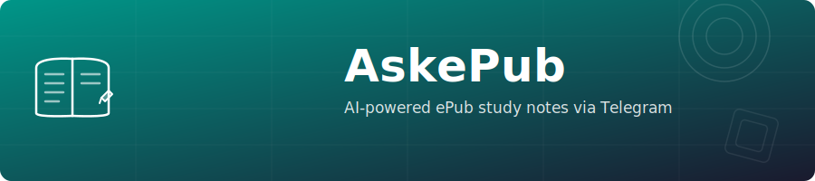

<p align="center"></p>

<p align="center"></p>

<h1 align="center">AskePub</h1>

<p align="center">
  <a href="https://github.com/GeiserX/askepub/blob/main/LICENSE"></a>
</p>

<p align="center"><strong>Telegram bot assistant to help you prepare ePubs. Uses ChatGPT-4o to write contextual notes.</strong></p>

---

## Features

- Upload any `.epub` file via Telegram
- Select specific chapters or study the entire book
- Customize up to 10 study questions (or use smart defaults)
- Get three output formats:
  - **Annotated ePub** with study notes injected into each chapter
  - **Word document** (.docx) with all notes organized by chapter
  - **PDF** with the same content
- Multi-language support (English, Spanish, Italian, French, German, Portuguese, Bulgarian)
- User access control via whitelist
- Rate limiting to manage API costs
- Admin notification and broadcast system

## Install

### Docker (recommended)

```sh
docker run --name askepub \
  -e TOKEN=your-telegram-bot-token \
  -e OPENAI_API_KEY=your-openai-key \
  -e ADMIN_ID=your-telegram-user-id \
  -e USER_IDS=id1,id2,id3 \
  -v askepub-dbs:/app/dbs \
  -v askepub-backups:/app/userBackups \
  drumsergio/askepub:2.0.0
```

### Docker Compose

```sh
docker compose up -d
```

See [`docker-compose.yml`](docker-compose.yml) for the full configuration.

### Environment Variables

| Variable | Required | Description |
|---|---|---|
| `TOKEN` | Yes | Telegram bot token from @BotFather |
| `OPENAI_API_KEY` | Yes | OpenAI API key |
| `ADMIN_ID` | Yes | Telegram user ID of the bot admin |
| `TOKEN_NOTIFY` | No | Secondary bot token for admin notifications |
| `USER_IDS` | No | Comma-separated Telegram user IDs allowed to use the bot |

## Usage

1. Start a chat with your bot on Telegram
2. Send `/start`
3. Select your language
4. Upload an `.epub` file
5. Choose which chapters to study
6. Customize your study questions (or use defaults)
7. Wait for the AI to generate notes
8. Download your annotated ePub, DOCX, and PDF

### Commands

- `/start` - Start the bot and begin a study session
- `/change_language` - Change your interface language
- `/cancel` - Cancel the current operation

## Maintainers

[@GeiserX](https://github.com/GeiserX)

## Contributing

Feel free to dive in! [Open an issue](https://github.com/GeiserX/askepub/issues/new) or submit PRs.

AskePub follows the [Contributor Covenant](http://contributor-covenant.org/version/2/1/) Code of Conduct.

## License

[MIT](LICENSE)
